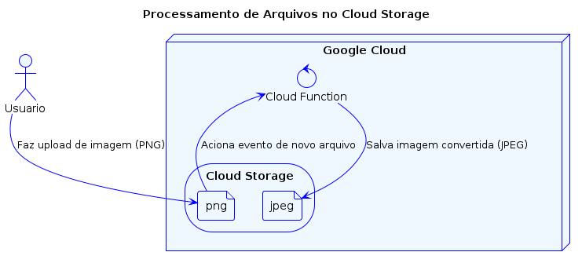
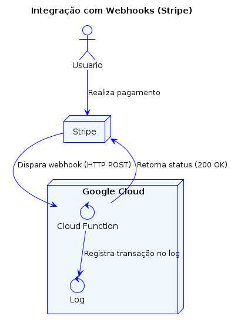
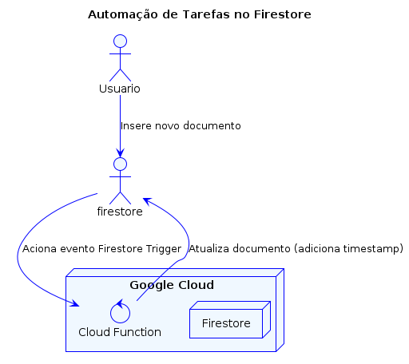
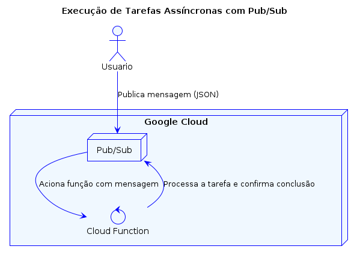
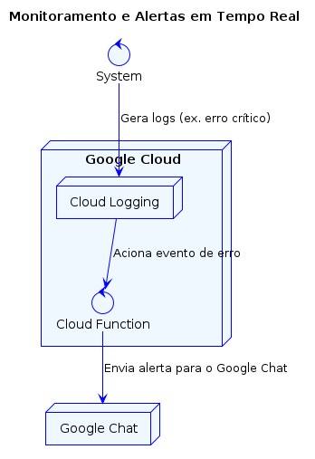

# Cloud Functions

## Use Cases

| #  | Caso de Uso                                      | Descrição |
|----|-------------------------------------------------|-----------|
| 1  | **Processamento de Arquivos em Cloud Storage**  | Aciona uma Cloud Function quando um arquivo é enviado ao **Cloud Storage**. Pode ser usado para converter imagens, transcodificar vídeos ou processar dados. |
| 2  | **Integração com APIs e Webhooks**              | Expondo um **endpoint HTTP**, a Cloud Function pode processar **webhooks** de serviços como Stripe, Slack e GitHub para automatizar fluxos de trabalho. |
| 3  | **Automação de Tarefas em Banco de Dados**      | Monitora mudanças em bancos como **Firestore** ou **Cloud SQL**, acionando eventos para validar dados, calcular estatísticas ou disparar notificações. |
| 4  | **Execução de Tarefas Assíncronas**             | Usa **Pub/Sub** para processar tarefas em segundo plano, como envio de e-mails, processamento de filas e geração de relatórios. |
| 5  | **Monitoramento e Alertas em Tempo Real**       | Reage a eventos do **Cloud Logging**, identificando erros críticos e enviando alertas para **Google Chat, Slack ou e-mail**. |

### 1 - **Processamento de Arquivos em Cloud Storage**

### 2 - **Integração com APIs e Webhooks**

### 3 - **Automação de Tarefas em Banco de Dados**

### 4 - **Execução de Tarefas Assíncronas**

### 5 - **Monitoramento e Alertas em Tempo Real**

## References

- https://cloud.google.com/functions/docs/calling/storage